# Restaurant Ordering System


The application demonstrates how to build a small but realistic domain (restaurant orders, menu, discounts, notifications) using multiple classic design patterns in a clean and extensible way.

---

## Screenshots and Diagrams

* Package diagram
  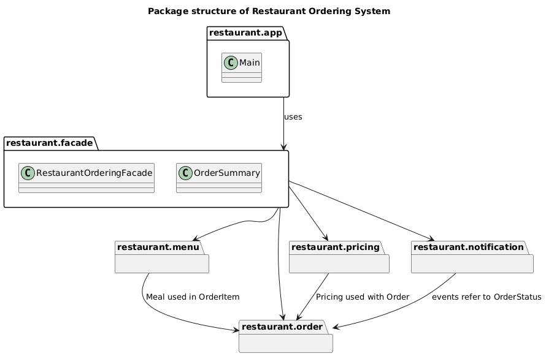

* Simplified class diagram
  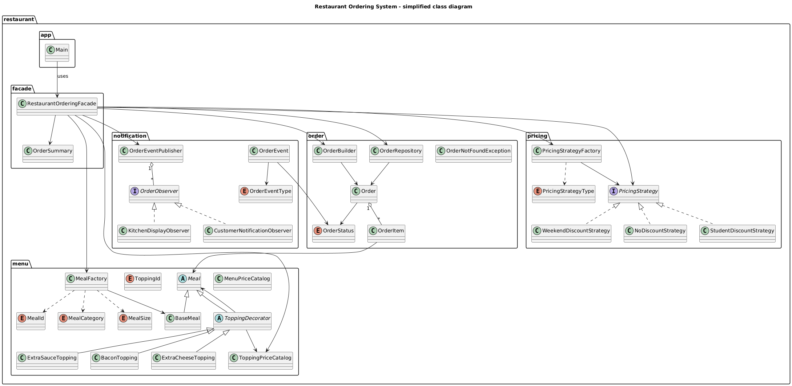

* Facade collaboration diagram
  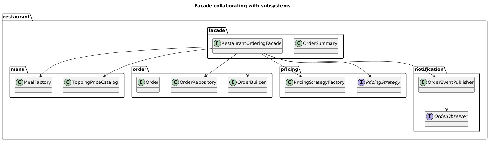

* Decorator pattern diagram
  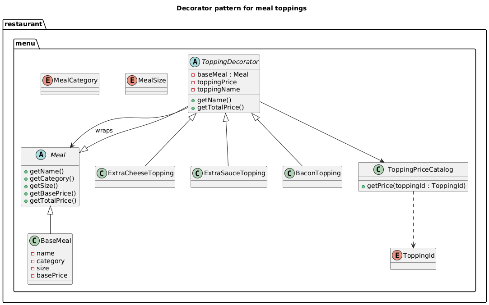

* Strategy pattern diagram
  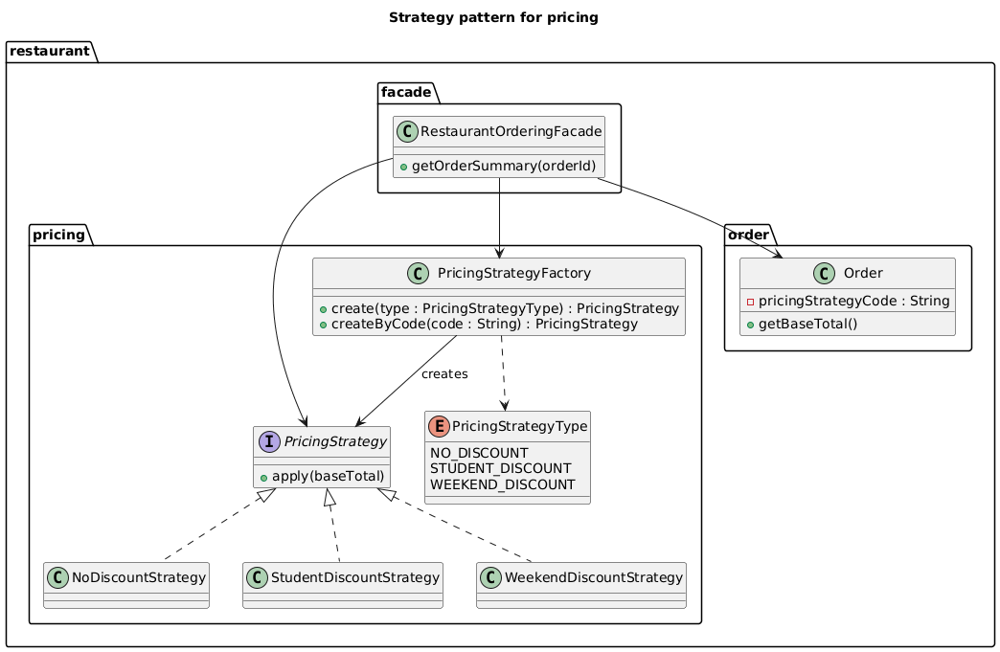

* Observer pattern diagram
  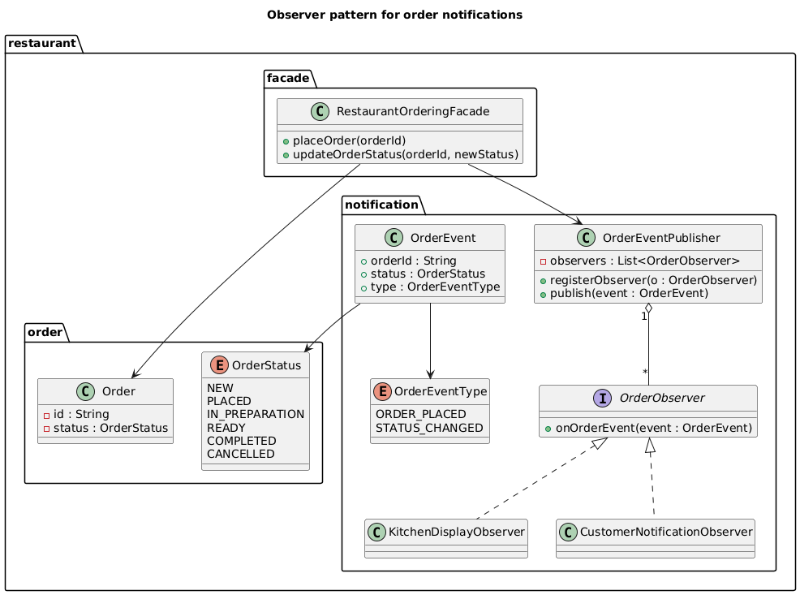

* Main sequence diagram
  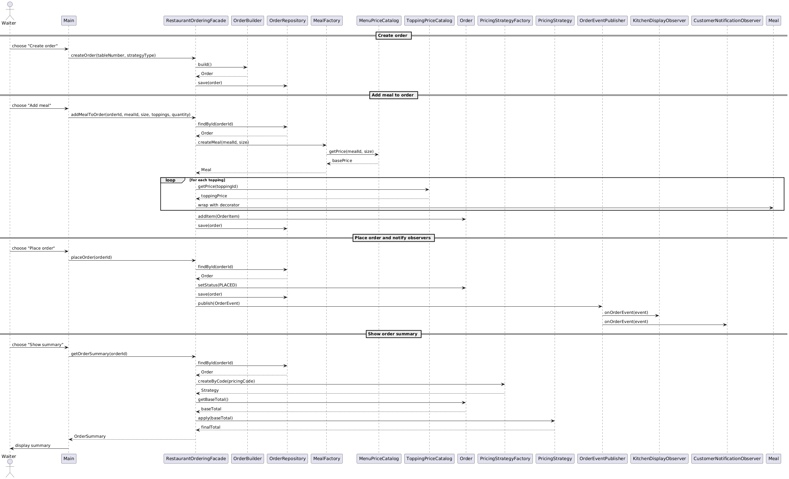

> Console screenshots:

* Main menu

 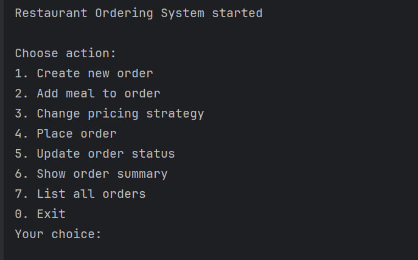

* Creating a new order

  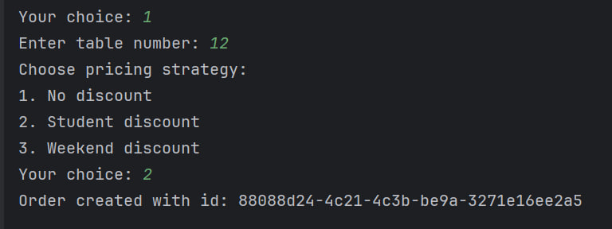

* Adding a meal with toppings

  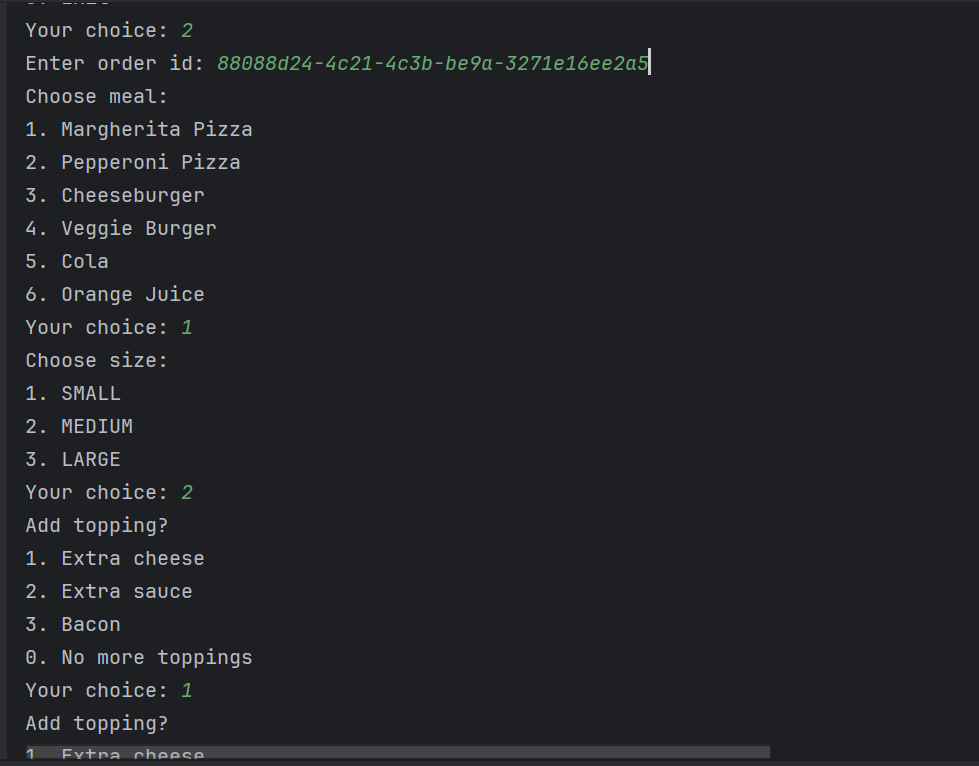
  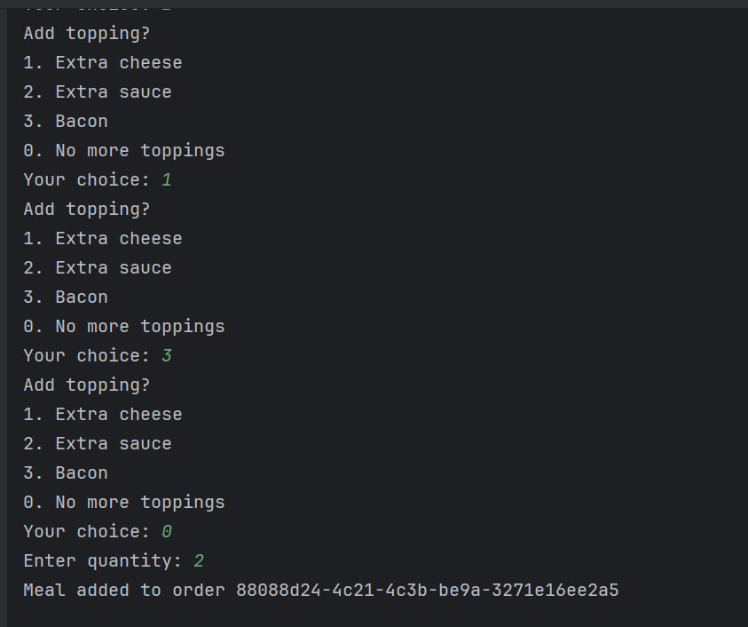
* Placing order and notifications
  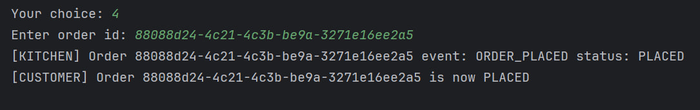

* Order summary with discount
  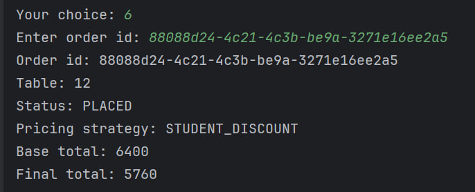

* List of all orders
  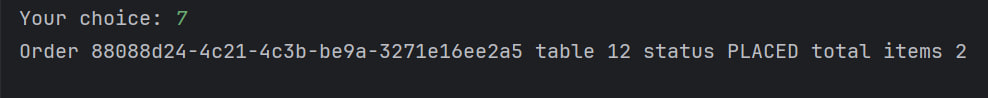

---

## Features

* Create restaurant orders for specific tables.
* Add meals with different sizes (SMALL, MEDIUM, LARGE).
* Add optional toppings using the Decorator pattern.
* Apply different pricing strategies:

    * No discount
    * Student discount
    * Weekend discount
* Track order status:

    * NEW, PLACED, IN_PREPARATION, READY, COMPLETED, CANCELLED
* Notify kitchen and customer about order events using Observer.
* Single entry point for the whole system via a Facade.

---

## Design Patterns Used

**Creational**

* **Factory Method**

    * `MealFactory` creates `Meal` objects based on `MealId` and `MealSize`.

* **Builder**

    * `OrderBuilder` constructs `Order` instances step by step.

**Structural**

* **Decorator**

    * `ToppingDecorator`, `ExtraCheeseTopping`, `ExtraSauceTopping`, `BaconTopping` dynamically add toppings and extra price to a `Meal`.

* **Facade**

    * `RestaurantOrderingFacade` provides a simple API for the UI and coordinates all subsystems.

**Behavioral**

* **Strategy**

    * `PricingStrategy` plus `NoDiscountStrategy`, `StudentDiscountStrategy`, `WeekendDiscountStrategy` implement different discount algorithms.
    * `PricingStrategyFactory` creates strategies by type or code.

* **Observer**

    * `OrderEventPublisher`, `OrderObserver`, `KitchenDisplayObserver`, `CustomerNotificationObserver` react to order events like placing an order or changing status.

---

## Project Structure

```text
restaurant-ordering-system/
├─ docs/                      # UML diagrams (PNG)
│   package-diagram.png
│   simple-class-diagram.png
│   facade-diagram.png
│   decorator-diagram.png
│   strategy-diagram.png
│   observer-diagram.png
│   sequence-diagram.png
├─ screenshots/               # Console screenshots (PNG)
│   app-menu.png
│   app-create-order.png
│   app-add-meal.png
│   app-place-order.png
│   app-summary.png
│   app-list-orders.png
├─ src/
│  └─ main/
│     └─ java/
│        └─ restaurant/
│           ├─ app/
│           │   └─ Main.java
│           ├─ facade/
│           │   ├─ RestaurantOrderingFacade.java
│           │   └─ OrderSummary.java
│           ├─ menu/
│           │   ├─ Meal.java
│           │   ├─ BaseMeal.java
│           │   ├─ MealCategory.java
│           │   ├─ MealSize.java
│           │   ├─ MealId.java
│           │   ├─ ToppingId.java
│           │   ├─ MenuPriceCatalog.java
│           │   ├─ ToppingPriceCatalog.java
│           │   ├─ MealFactory.java
│           │   ├─ ToppingDecorator.java
│           │   ├─ ExtraCheeseTopping.java
│           │   ├─ ExtraSauceTopping.java
│           │   └─ BaconTopping.java
│           ├─ order/
│           │   ├─ OrderStatus.java
│           │   ├─ OrderItem.java
│           │   ├─ Order.java
│           │   ├─ OrderBuilder.java
│           │   ├─ OrderRepository.java
│           │   └─ OrderNotFoundException.java
│           ├─ pricing/
│           │   ├─ PricingStrategyType.java
│           │   ├─ PricingStrategy.java
│           │   ├─ NoDiscountStrategy.java
│           │   ├─ StudentDiscountStrategy.java
│           │   ├─ WeekendDiscountStrategy.java
│           │   └─ PricingStrategyFactory.java
│           └─ notification/
│               ├─ OrderEventType.java
│               ├─ OrderEvent.java
│               ├─ OrderObserver.java
│               ├─ OrderEventPublisher.java
│               ├─ KitchenDisplayObserver.java
│               └─ CustomerNotificationObserver.java
└─ README.md
```

---

## Requirements

* Java 17+
* IntelliJ IDEA (Community Edition is enough)

---

## How to Run

### Option 1 – IntelliJ IDEA

1. Clone or download the repository:

   ```bash
   git clone https://github.com/aset-syrgabaev/restaurant-ordering-system.git
   ```

2. Open the project in IntelliJ IDEA.

3. Make sure the SDK is set to **Java 17**.

4. In the Project panel, open:

   `src/main/java/restaurant/app/Main.java`

5. Right-click `Main` → `Run 'Main.main()'`.

The console will show:

```text
Restaurant Ordering System started

Choose action:
1. Create new order
2. Add meal to order
3. Change pricing strategy
4. Place order
5. Update order status
6. Show order summary
7. List all orders
0. Exit
Your choice:
```

Then you can interact with the system using numeric choices.

---

## Usage Example

Typical scenario:

1. **Create new order**

    * Choose `1` in the menu.
    * Enter table number (e.g. `12`).
    * Choose pricing strategy:

        * `1` – No discount
        * `2` – Student discount
        * `3` – Weekend discount
    * The system prints the new `order id`.

2. **Add meal to order**

    * Choose `2`.
    * Enter the `order id`.
    * Choose meal:

        * `1` – Margherita Pizza
        * `2` – Pepperoni Pizza
        * `3` – Cheeseburger
        * `4` – Veggie Burger
        * `5` – Cola
        * `6` – Orange Juice
    * Choose size: `1` SMALL, `2` MEDIUM, `3` LARGE.
    * Optionally add toppings:

        * `1` – Extra cheese
        * `2` – Extra sauce
        * `3` – Bacon
        * `0` – No more toppings
    * Enter quantity.

3. **Place order**

    * Choose `4`.
    * Enter the `order id`.
    * Observer notifications appear:

        * `[KITCHEN] ...`
        * `[CUSTOMER] ...`

4. **Update status**

    * Choose `5`.
    * Enter `order id`.
    * Choose new status:

        * `1` – IN_PREPARATION
        * `2` – READY
        * `3` – COMPLETED
        * `4` – CANCELLED

5. **Show order summary**

    * Choose `6`.
    * Enter `order id`.
    * The system prints:

        * table number
        * status
        * pricing strategy
        * base total price
        * final price after discount

6. **List all orders**

    * Choose `7` to see all orders with table numbers, statuses and total items.

---

## Team

* **Aset Syrgabaev** – Factory Method, Strategy, integration.
* **Kuanysh Asaubaev** – Decorator, Facade, menu model.
* **Nuradilet Mustafa** – Observer, Builder, order domain.

All team members participated in testing, refactoring and documentation.
